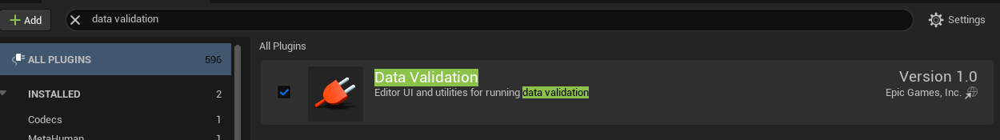
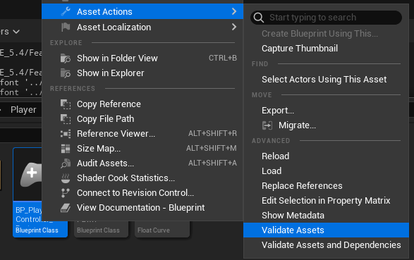

+++
title = 'Data Validation - Unreal Engine 5 - C++'
date = 2025-02-19T18:01:19Z
draft = true
+++

Validating your own classes and data is a vital step in most projects, and especially with a lack of a proper QA department/step that cannot catch all bugs. Making sure that all the data that is cooked into the project is in the proper form that your code expects to, in order to execute as intended and prevent undefined behaviour whereever possible. 

The first step on how to do this is to enable the Data Validation Plugin



After restarting the editor you should now have access to the asset action for validation




## C++ Validation

We will need to overwrite the following function in order to validate **any** C++ **UObject** class.
```c++
	virtual EDataValidationResult IsDataValid(FDataValidationContext& Context) const override;
```

This function is only available when using the editor, so we will need to wrap it in a preprocessor block that will automatically remove it when we package it into a build.
Thankfully, this is quite simple to do.

```C++
#if WITH_EDITOR
	virtual EDataValidationResult IsDataValid(FDataValidationContext& Context) const override;
#endif
```


Finally, defining this function is where we can perform our custom validation. We need to wrap this function body with the preprocessor as well, as it will cause an error when building if we do not. 

```c++
#if WITH_EDITOR

EDataValidationResult UCustomObject::IsDataValid(FDataValidationContext& Context) const
{
	EDataValidationResult Result = Super::IsDataValid(Context);

	return Result;
}
#endif
```
You will also get an error with `Context` parameter as the type is not included automatically. I usually include it in the definition's preprocessor block, to prevent unnecessary linking when building

In order to add to the `Context` parameter, we can add to the body with a block like this:
```c++

#if WITH_EDITOR
#include "Misc/DataValidation.h"

EDataValidationResult UCustomObject::IsDataValid(FDataValidationContext& Context) const
{
	if(!IsValid(property))
	{
		Result = EDataValidationResult::Invalid;
		Context.AddMessage(this, EMessageSeverity::Error, FText::FromString("property is Null"));
	}
}

#endif
```
The parameters in order are:
 - The Asset that we are validating, usually this is just a reference to self (`this`)
 - The Message Severity, which is quite self explanatory
 - The Message to print out into the log

## Final Thoughts

Data Validation is vital and is easily one of the more efficient use of development time when creating complex and simple features. It takes a few minutes and can easily catch errors and warnings that would otherwise could fall through the cracks. 