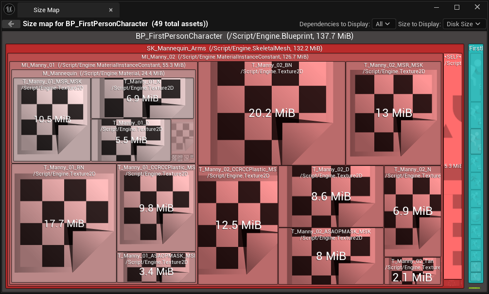

+++
title = 'Multiplayer Character Selection'
date = 2025-10-01T13:54:48+01:00
draft = true
+++

# Intro

Being able to select a character to play as, is a vital component for some multiplayer and singleplayer games but there are a lot of ways that this can be achieved. Some of these methods are better than others, and will depend on the engine used. In this article, I will be using Unreal Engine 5, and so will be using one of the best workflows for it. 


# Overview

I will be using the Seamless Travel feature of UE5 to maintain the data when we travel from the character selection screen to the game map. This is assuming that these are two separate maps, but it would work even if the character selection is the same map to the in-game content. 

I have my own fork of UE5, so I would usually add these changes to the engine itself. But I know that not everyone will have access to this, so I'll use an actor component to keep the data and use child classes of the engine classes to maintain the data. 

# Setup

We need to set a travel map in the project settings, in order for Seamless Travel to work.


# C++ Implementation

## Character Select Component

This is the main part of the system, it is essentially a wrapper around a soft class ptr that gets set on the server and replicated to the player. We will be attaching it to the player controller, so it only replicates to the owning player by default. 

I started with the essential parts of the system; the ability to set the Character Class via an RPC, a RepNotify and the actual class pointer. The RepNotify just calls the `OnCharacterClassChanged` delegate on the client. 


```c++
	
	DECLARE_DYNAMIC_MULTICAST_DELEGATE_OneParam(FOnCharacterClassChanged, TSoftClassPtr<APawn>, NewCharacterClass);

	UPROPERTY(BlueprintAssignable, Category = "Character Select")
	FOnCharacterClassChanged OnCharacterClassChanged;

protected:

	UFUNCTION(Server, Reliable)
	void Server_SetCharacterClass(const TSoftClassPtr<APawn>& NewCharacterClass);

	UFUNCTION(Category = "Character Select")
	void OnRep_CharacterClassChanged() const;
	
	UPROPERTY(BlueprintReadOnly, ReplicatedUsing=OnRep_CharacterClassChanged, Category = "Character Select")
	TSoftClassPtr<APawn> CharacterClass;

```

As all of these functions are protected, the natural progression is an entry point for external use. I set it up with two main functions, with one that can only be called from the server and the other can be called wherever, regardless of Net Role. 

```c++
public:

	UFUNCTION(BlueprintAuthorityOnly, BlueprintCallable, Category = "Character Select", meta=(AutoCreateRefTerm = "NewCharacterClass"))
	void SetCharacterClass(const TSoftClassPtr<APawn>& NewCharacterClass);

	UFUNCTION(BlueprintCallable, Category = "Character Select", meta=(AutoCreateRefTerm = "NewCharacterClass"))
	void AttemptSetCharacterClass(const TSoftClassPtr<APawn>& NewCharacterClass);

```

In the implementation of these functions, I performed multiple layers of validation. This is to ensure that the code will only update when there is a valid change. 

```c++
void UBaseCharacterSelectComponent::SetCharacterClass(const TSoftClassPtr<APawn>& NewCharacterClass)
{
	if(!GetOwner()->HasAuthority())
	{
		UE_LOG(LogTemp, Warning, TEXT("SetCharacterClass called on non-authoritative client!"));
		return;
	}

	if(CharacterClass == NewCharacterClass)
	{
		UE_LOG(LogTemp, Log, TEXT("CharacterClass is already set to [%s], no change needed."), *NewCharacterClass.ToString());
		return; // No change, do nothing
	}

	if(NewCharacterClass.IsNull())
	{
		UE_LOG(LogTemp, Warning, TEXT("Attempted to set an invalid character class!"));
		return; // Invalid class, do nothing
	}

	UE_LOG(LogTemp, Log, TEXT("Setting CharacterClass to [%s]"), *NewCharacterClass.ToString());
	CharacterClass = NewCharacterClass;
	OnCharacterClassChanged.Broadcast(CharacterClass);
}

void UBaseCharacterSelectComponent::AttemptSetCharacterClass(const TSoftClassPtr<APawn>& NewCharacterClass)
{
	UE_LOG(LogTemp, Log, TEXT("Attempting to set CharacterClass to [%s]"), *NewCharacterClass.ToString());
	if(GetOwner()->HasAuthority())
	{
		UE_LOG(LogTemp, Log, TEXT("Authority detected, setting CharacterClass directly."));
		SetCharacterClass(NewCharacterClass);
	}
	else
	{
		UE_LOG(LogTemp, Log, TEXT("Authority not detected, calling server function to set CharacterClass."));
		Server_SetCharacterClass(NewCharacterClass);
	}
}


void UBaseCharacterSelectComponent::Server_SetCharacterClass_Implementation(const TSoftClassPtr<APawn>& NewCharacterClass)
{
	UE_LOG(LogTemp, Log, TEXT("Server_SetCharacterClass called with [%s]"), *NewCharacterClass.ToString());
	SetCharacterClass(NewCharacterClass);
}


void UBaseCharacterSelectComponent::OnRep_CharacterClassChanged() const
{
	UE_LOG(LogTemp, Log, TEXT("OnRep_CharacterClassChanged called, new CharacterClass is [%s]"), *CharacterClass.ToString());
	OnCharacterClassChanged.Broadcast(CharacterClass);
}

```

Now for the most important part, the replication. This is also the easiest part of this component. We just need to set the component to replicate by default, and register the `CharacterClass` variable in `GetLifetimeReplicatedProps`. 

```c++
// Sets default values for this component's properties
UBaseCharacterSelectComponent::UBaseCharacterSelectComponent()
{
	SetIsReplicatedByDefault(true);
}
void UBaseCharacterSelectComponent::GetLifetimeReplicatedProps(TArray<FLifetimeProperty>& OutLifetimeProps) const
{
	Super::GetLifetimeReplicatedProps(OutLifetimeProps);
	DOREPLIFETIME(UBaseCharacterSelectComponent, CharacterClass);
}
```


## Player Controller

This is relatively easy to setup, as all is needed is a constructor, `SeamlessTravelTo` and of course the `CharacterSelectComponent`.  

```c++
	
public:

	ADevPlayerController();
	
	virtual void SeamlessTravelTo(APlayerController* NewPC) override;

protected:

	UPROPERTY(VisibleAnywhere, BlueprintReadOnly, Category = "Character Select")
	TObjectPtr<UBaseCharacterSelectComponent> CharacterSelectComponent;
```

When defined, the constructor will automatically create the character select component and ensure that the controller replicates. The  `SeamlessTravelTo` will simply copy over the character class variable to the new `CharacterSelectComponent`

```c++
ADevPlayerController::ADevPlayerController()
{
	CharacterSelectComponent = CreateDefaultSubobject<UBaseCharacterSelectComponent>(TEXT("CharacterSelectComponent"));
	bReplicates = true; // Ensure this controller replicates
}

void ADevPlayerController::SeamlessTravelTo(APlayerController* NewPC)
{
	check(NewPC);
	UBaseCharacterSelectComponent* NewCharacterSelectComponent = NewPC->FindComponentByClass<UBaseCharacterSelectComponent>();
	if (IsValid(NewCharacterSelectComponent))
	{
		UE_LOG(LogTemp, Log, TEXT("SeamlessTravelTo: Setting CharacterClass to [%s] in CharacterSelectComponent"), *CharacterSelectComponent->GetCharacterClass().ToString());
	}
	else
	{
		UE_LOG(LogTemp, Log, TEXT("SeamlessTravelTo: Couldn't find CharacterSelectComponent in NewPC"));
	}
	
	Super::SeamlessTravelTo(NewPC);
}
```

We also need a C++ wrapper around the Server Travel function, so we can call it from Blueprint. The normal BP `OpenLevel` calls Client Travel, which doesn't support Seamless Travel.
```c++
void ADevPlayerController::ServerTravelToMap(TSoftObjectPtr<UWorld> NewMap)
{
	const FString LevelName = FPackageName::ObjectPathToPackageName(NewMap.ToString());
	GetWorld()->ServerTravel(LevelName, false, false);
}
```

## BP Implementation

### Game Mode

In the editor, I needed to make a new Gamemode as this is what controls what pawn is spawned in. Then all is needed is to override the `GetDefaultPawnForController` function:


It is important to note that the Soft Class Ptr for the Pawn was chosen over the TSubclassPtr to reduce the memory overhead of the character selection. Though this does mean that the class has to be loaded synchronously here, that is a good tradeoff in my use case. This means that I need to be mindful of the amount of hard references being used in the Pawn classes, so good use of best practises and verifying the size of the asset in the asset map is vital when using a system like this.




We also need to enable Seamless Travel on our Lobby Gamemode. This is an important, albeit small detail that is often missed.


### Player Controller

Make a child class of the C++ Player Controller, and listen for the change in the character class. When a change is detected on the server (using an authority switch), restart the player. This will trigger the `GetDefaultPawnForController` on the game mode and essentially respawn the player as that pawn.


### UI 

Now onto the final part of the implementation. I have two buttons that are used in the character selection, that when pressed will attempt to set the character class. 


Now we need to call our `ServerTravelToMap` on our custom Player controller. 


# Next Steps

Right now, this works for both single player and multiplayer. Though it is important to note that **this won't work with PIE, and will only work in packaged and standalone**.

It would be a good idea to integrate this with a save system, so that the player can choose a character once. I'd like to Update the game mode so that each player is assigned a player start actor to spawn in on, rather than them all spawning in on top of one another. 