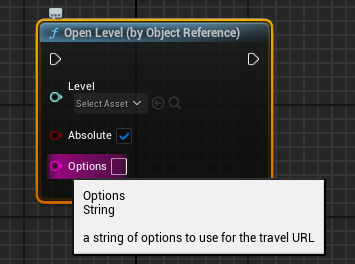
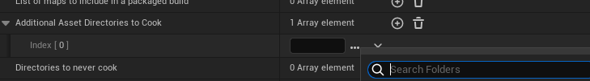
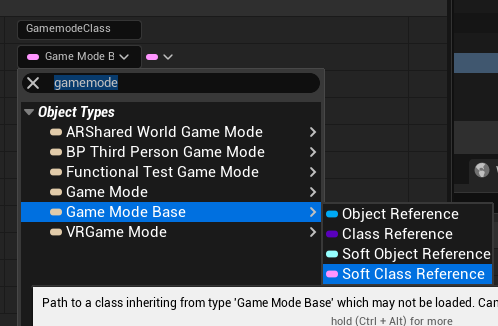
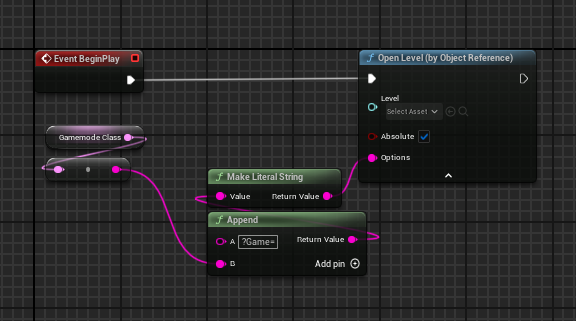

+++
title = 'Loading Different Gamemodes on the Same Map - Unreal Engine 5'
date = 2024-09-06T12:43:31+01:00
draft = true
+++

Being able to simply change the gamemode to play at runtime is a great idea for a lot of developers. It makes sense to be able to save time making one map, but make it playable for multiple game modes. 

However, doing this has eluded many developers when it is actually quite simple to do when you know how to do it. 

The trick is to use Travel URLs when moving between different maps. Many developers may already be familiar with these URLs as they are how you move between different levels and may already 
be passing in their own **Options** into these functions. 




## Explanation

You can pass in your own options here, but Unreal has a few travel options built in with `Game` being one of them. This is the one that we want to overwrite.

I'm not sure if I can show the body of code that does this (so I'll omit it), but this is the function that parses the URL and retrieves the parameter for the gamemode. 

```c++
AGameModeBase* UGameInstance::CreateGameModeForURL(FURL InURL, UWorld* InWorld)
```

What the code does is retrieves the default gamemode for the map, then checks to see if there is an Option in the URL that points to a GameMode that should be loaded instead. 

We need to format the code in a very particular way in order for it to load in appropriately. 

For example, I have a game map that is defaulted to a base gamemode. I want to be able overwrite it with either a Campaign Gamemode or a Multiplayer Gamemode and I don't want to create 2 versions of the same map.

When I pass in the options, I need to start the option with an `?` to signal to the engine that this is the end of the previous option and the start of another. The name of the param is `Game` as mentioned above, and 
now we enter in the path to the asset. This is another small change, as the built engine sort of remaps the Content folder to a new folder called Game, so we need to name the root folder of the path to `/Game` rather than `/Content`.

Finally, when we get to our asset, we need to reformat it again such that `BP_Gamemode` becomes `BP_Gamemode.BP_Gamemode_C`. From what I can tell from the source code, this signals to the engine that we are loading in an class asset rather than an object already instantiated. 


## Outcome

Putting all of this together, it comes out to:

`?Game=/Game/Core/Campaign/BP_CampaignGameMode.BP_CampaignGameMode_C`

Enter this into the Options when travelling and it should work as intended.

### Potential Problems and Improvements

I've ran into a few small problems when using this system. The main one was that the GameMode wouldn't load in on a packaged build.

This was caused by the GameMode not being cooked into the build, because nothing included in the game was referencing the asset directly or indirectly due to this being a string rather than a reference. This was fixed rather easily, by ensuring that the `Core` folder was always cooked. I could have only done this for the Campaign folder, but I don't want to run into this problem again with other classes that are considered Core to the project. 



Another one that I ran into was entirely my fault and is inherent to using strings, but be careful when moving the asset that you update the path to the asset. This can be resolved for you in the engine by using a `Soft Class Reference`. This can easily be converted into a string which will make the hardcoded string, and will update when you move the asset. I would highly recommend using this over using a hardcoded string, as you can also load this into memory asynchronously if needed and won't increase the size of the asset it is being held in due to hard references.  



## Improved Version

Using the previous improvement, we get this version that I would consider a good final version assuming that we don't want to pass in another options



If we did, then we can just append a new string starting with `?` to add in more options. 

For level travelling, I would recommend ensuring that it is in a consistent place throughout the project. You do not want to place one instance in the UI and then another in the game instance and yet another in the game mode. You can request the travel on all of these places, but I would recommend placing it on the Player Controller with a wrapper function. This is due to it's advantageous position when dealing with multiplayer to be on only one client and the server, allowing easier Server/Client travel requests. The UI can then request these wrapped travel functions, but the Player Controller deals with it. Another good candidate (that I also use) is a subsystem, I would go for a Game Instance or Local Player Subsystem as these have a lot more lifetime and are more persistent compared to World Subsystems and (in my experience) more stable than Engine Subsystems. 